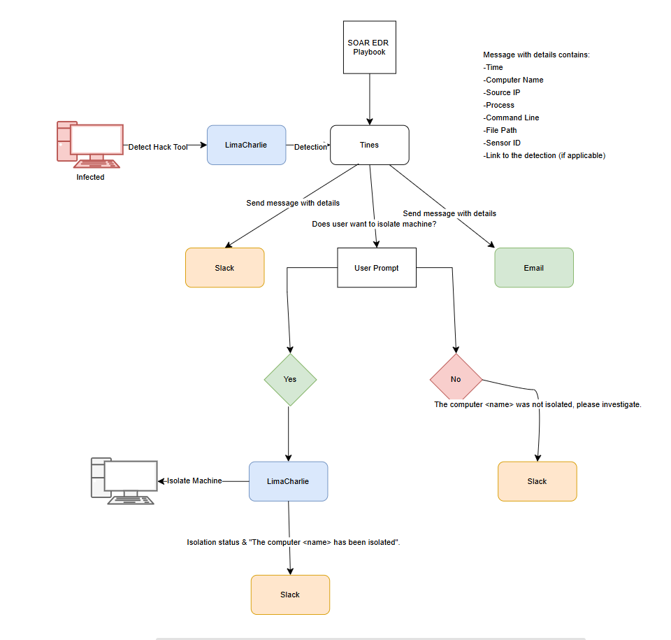

# SOAR-EDR-Project
This project is a Security Orchestration, Automation, and Response (SOAR) pipeline built on top of an Endpoint Detection and Response (EDR) solution. It detects malicious activity on endpoints using LimaCharlie, and automates response actions via Tines, with real-time alerting and interaction through Slack, and email notification for audit and follow-up.

## Project Overview

- **Goal:** Detect usage of hacking tools (e.g., LaZagne) on endpoints and automatically alert and respond.
- **Response Options:** Isolate the infected machine based on a human-in-the-loop decision via Slack.
- **Audit Trail:** All incidents are emailed to a designated security mailbox.

  ## Tech Stack

| Tool           | Purpose                                  |
|----------------|------------------------------------------|
| **LimaCharlie** | Endpoint detection + rule engine        |
| **Tines**       | SOAR orchestration platform             |
| **Slack**       | Analyst interaction + alerting          |
| **Python**      | Isolation script (triggered by Tines)   |
| **SMTP/Email**  | Incident reporting                      |
-------------------------------------------------------------

## Workflow Diagram

)

1. Endpoint activity is monitored by LimaCharlie
2. Detection of hacking tool triggers a webhook to Tines
3. Tines sends a Slack alert with user prompt
4. If user confirms → machine isolation is triggered
5. Tines also sends an email summary of the incident

### LimaCharlie
- Deploy agent to test endpoint
- Create detection rule for tool like `LaZagne`
- Configure webhook to send detection data to Tines

### Tines
- Build a story with these actions:
  - Trigger on webhook from LimaCharlie
  - Send Slack message with button options
  - On response, call isolation script or skip
  - Send email summary

### Slack
- Create Incoming Webhook
- Add Tines app for interaction

- ## Troubleshooting

- **Sensor not reporting**: Ensure the installation key is correct and network allows outbound connections.
- **Tines not receiving data**: Double-check webhook is configured as an Output in LimaCharlie.
- **Slack messages not appearing**: Make sure Slack app has permissions and is installed correctly.

- ## How to Test

1. Deploy sensor to a test machine.
2. Run `LaZagne.exe` on the endpoint.
3. Observe:
   - Detection in LimaCharlie.
   - Slack alert in your channel.
   - Email alert in your inbox.
   - Optional: Confirm machine isolation via Slack button.

